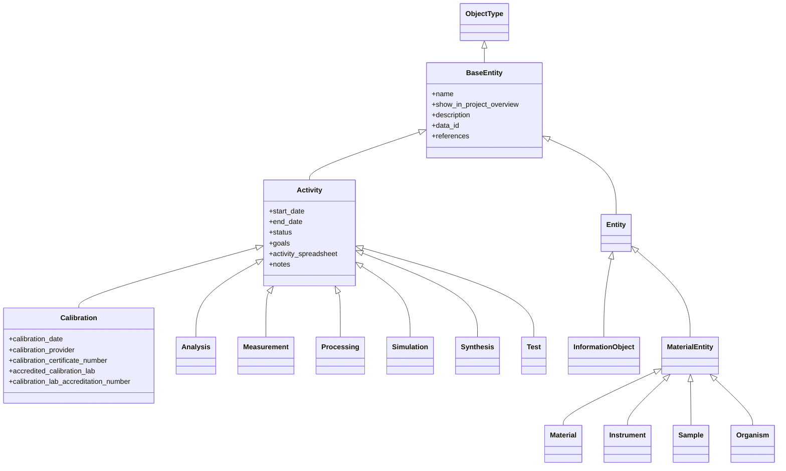

# Datamodel V2 Base Structure

This page documents the classes and `PropertyTypeAssignment`s defined in
`bam_masterdata/datamodel/v2/base.py`, and only those definitions.

## Inheritance Structure

The diagram shows the inheritance tree and the properties defined locally on each class.
Inherited properties are summarized in the table below.



## Class Summary

| Class | Parent | `defs.code` | Local `PropertyTypeAssignment`s | Effective property count |
| --- | --- | --- | --- | ---: |
| `BaseEntity` | `ObjectType` | `BASE_ENTITY` | `name`, `show_in_project_overview`, `description`, `data_id`, `references` | 5 |
| `Activity` | `BaseEntity` | `ACTIVITY` | `start_date`, `end_date`, `status`, `goals`, `activity_spreadsheet`, `notes` | 11 |
| `Analysis` | `Activity` | `ANALYSIS` | none | 11 |
| `Calibration` | `Activity` | `CALIBRATION` | `calibration_date`, `calibration_provider`, `calibration_certificate_number`, `accredited_calibration_lab`, `calibration_lab_accreditation_number` | 16 |
| `Measurement` | `Activity` | `MEASUREMENT` | none | 11 |
| `Processing` | `Activity` | `PROCESSING` | none | 11 |
| `Simulation` | `Activity` | `SIMULATION` | none | 11 |
| `Synthesis` | `Activity` | `SYNTHESIS` | none | 11 |
| `Test` | `Activity` | `TEST` | none | 11 |
| `Entity` | `BaseEntity` | `ENTITY` | none | 5 |
| `InformationObject` | `Entity` | `INFORMATION_OBJECT` | none | 5 |
| `MaterialEntity` | `Entity` | `MATERIAL_ENTITY` | none | 5 |
| `Material` | `MaterialEntity` | `MATERIAL` | none | 5 |
| `Instrument` | `MaterialEntity` | `INSTRUMENT` | none | 5 |
| `Sample` | `MaterialEntity` | `SAMPLE` | none | 5 |
| `Organism` | `MaterialEntity` | `ORGANISM` | none | 5 |

## PropertyTypeAssignment Details

Only `BaseEntity`, `Activity`, and `Calibration` define local `PropertyTypeAssignment`s in
`base.py`. Every other class in the file inherits its effective properties unchanged from a parent.

### `BaseEntity`

#### `name`

```yaml
code: $NAME
data_type: VARCHAR
property_label: Name
description: Human-readable name used to identify the entity in user interfaces, reports, and search results.
mandatory: true
section: General Information
```

#### `show_in_project_overview`

```yaml
code: $SHOW_IN_PROJECT_OVERVIEW
data_type: BOOLEAN
property_label: Visible in project overview?
description: Controls whether the entity is displayed in the project overview page.
mandatory: false
section: General Information
```

#### `description`

```yaml
code: DESCRIPTION
data_type: MULTILINE_VARCHAR
property_label: Description
description: Human-readable description of the entity.
mandatory: false
section: References
previous_versions:
  - EXPERIMENTAL_STEP.EXPERIMENTAL_DESCRIPTION
```

#### `data_id`

```yaml
code: DATA_ID
data_type: VARCHAR
property_label: ID
description: Persistent identifier used to uniquely identify the entity. It can be any unique identifier that can be used to reference the entity internally or in external systems or databases.
mandatory: false
section: References
previous_versions:
  - PUBLICATION
```

#### `references`

```yaml
code: REFERENCE
data_type: MULTILINE_VARCHAR
property_label: References
description: Links/DOIs/URLs relevant to this entity (one per line).
mandatory: false
section: References
```

### `Activity`

#### `start_date`

```yaml
code: START_DATE
data_type: TIMESTAMP
property_label: Start date
description: Start date of the activity.
mandatory: false
section: General Information
```

#### `end_date`

```yaml
code: END_DATE
data_type: TIMESTAMP
property_label: End date
description: End date of the activity.
mandatory: false
section: General Information
```

#### `status`

```yaml
code: ACTIVITY_STATUS
data_type: CONTROLLEDVOCABULARY
vocabulary_code: ACTIVITY_STATUS
property_label: Status
description: Current status of the activity: PLANNED, RUNNING, COMPLETED, CANCELLED.
mandatory: false
section: General Information
previous_versions:
  - FINISHED_FLAG
```

#### `goals`

```yaml
code: GOALS
data_type: MULTILINE_VARCHAR
property_label: Goals
description: Goals of the activity in free-text format.
mandatory: false
section: Activity Details
previous_versions:
  - EXPERIMENTAL_STEP.EXPERIMENTAL_GOALS
```

#### `activity_spreadsheet`

```yaml
code: SPREADSHEET
data_type: XML
property_label: Spreadsheet
description: Structured spreadsheet used to capture tabular parameters, intermediate values, or structured notes associated with an entity. This field is intended for lightweight, human-curated data and is not a replacement for datasets or result files.
mandatory: false
section: Activity Details
previous_versions:
  - EXPERIMENTAL_STEP.SPREADSHEET
```

#### `notes`

```yaml
code: NOTES
data_type: MULTILINE_VARCHAR
property_label: Notes
description: Free-form notes.
mandatory: false
section: Additional Information
```

### `Calibration`

#### `calibration_date`

```yaml
code: CALIBRATION_DATE
data_type: DATE
property_label: Calibration date
description: Date when the calibration was performed.
mandatory: true
section: Calibration Information
```

#### `calibration_provider`

```yaml
code: CALIBRATION_PROVIDER
data_type: VARCHAR
vocabulary_code: CALIBRATION_PROVIDER
property_label: Calibration provider
description: Organization or service provider that performed the calibration.
mandatory: true
section: Calibration Information
```

#### `calibration_certificate_number`

```yaml
code: CALIBRATION_CERTIFICATE_NUMBER
data_type: VARCHAR
property_label: Calibration certificate number
description: Identifier of the calibration certificate issued for this calibration.
mandatory: true
section: Calibration Information
```

#### `accredited_calibration_lab`

```yaml
code: ACCREDITED_CALIBRATION_LAB
data_type: BOOLEAN
property_label: Calibration performed by an Accredited Laboratory?
description: Indicates whether the calibration was performed by an accredited laboratory.
mandatory: true
section: Calibration Information
previous_versions:
  - ACCREDITATED_CALIBRATION_LAB
```

#### `calibration_lab_accreditation_number`

```yaml
code: CALIBRATION_LAB_ACCREDITATION_NUMBER
data_type: VARCHAR
property_label: Calibration Laboratory Accreditation Number
description: Accreditation identifier of the laboratory (required if the calibration was performed by an accredited laboratory).
mandatory: false
section: Calibration Information
```
