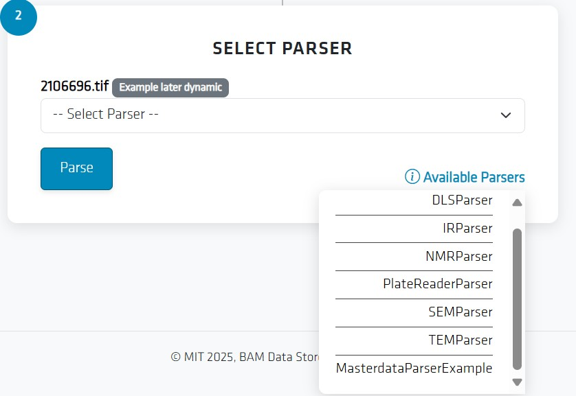

# How-to: Using the Masterdata Parser App

This guide shows you how to use the Masterdata Parser App through your browser to upload data, run parsing, and upload to Data Store.

## Goal

By the end of this guide, you will be able to:
- Open the Parser App in your browser
- Upload a file for parsing
- Run the parser and view the results
- Upload the Data to the Data Store

## Steps

### Open the App
1. Open your web browser.
2. Go to the provided URL of the Parser App (e.g., `https://parser.example.com`).
3. The login page of the app will appear.

{ width=400 }

### Login to the App
1. Enter your Username
2. Enter your Password
3. Press Login

### Select and Upload Files
1. Select the Space where Data will be saved.
2. Enter Project and Collection Name.
3. Drag and Drop or Click to Select Files.
4. Click and chose or Drag & Drop Files in Area
5. Press Upload Files to upload Files.
    - Click the Reset Button to reset the next Steps

{ width=400 }

### Select Parsers
1. Chose a Parser by clicking Select Parser for each uploaded file.
    - Avaliable Parsers are listed in the Corner.
    - Check [Creating new Parsers](newparsers.md) for creating your own parsers.
2. Press Parse to Parse the Metadata from each file and upload it to the Data Store.

{ width=400 }

### Review Logs
1. Look at Logs to see sucsessfull parsing.

{ width=400 }

## Tips & Troubleshooting
- Make sure the file format is supported by the parser
- If parsing fails, check the logs and that the file is not corrupt
