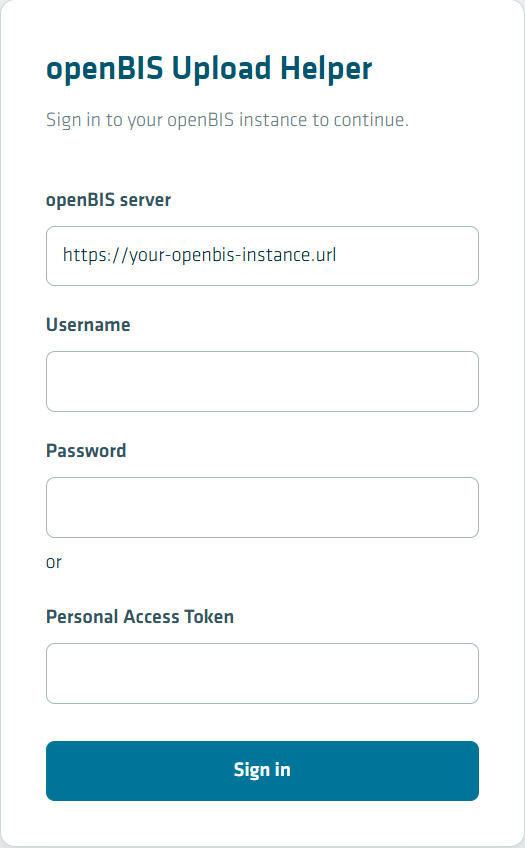
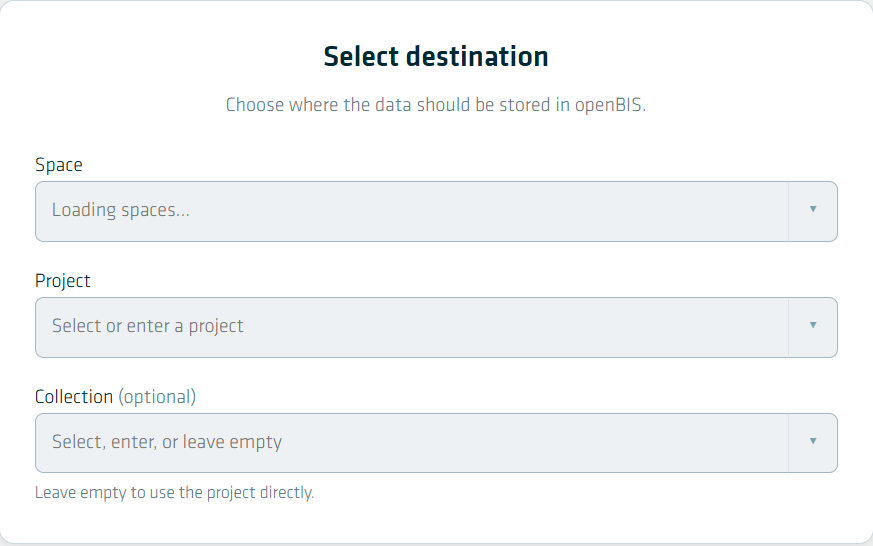
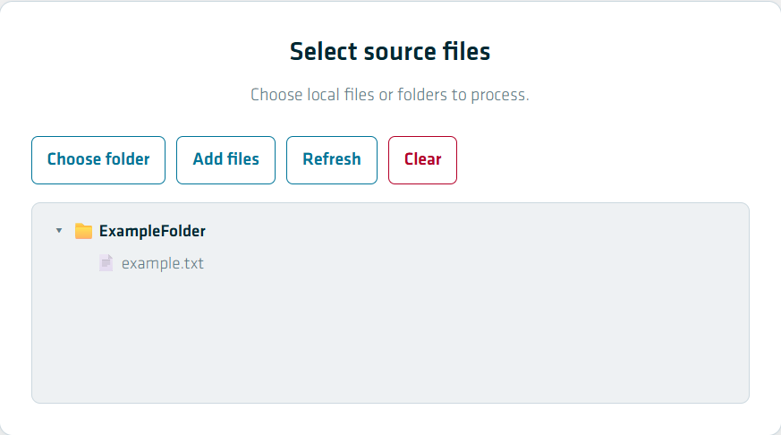
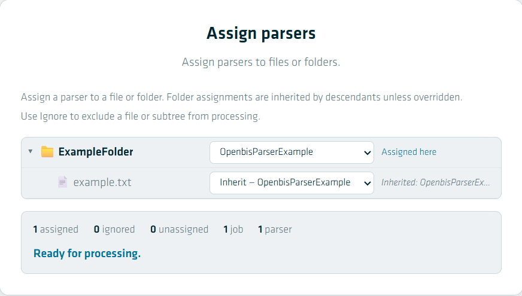
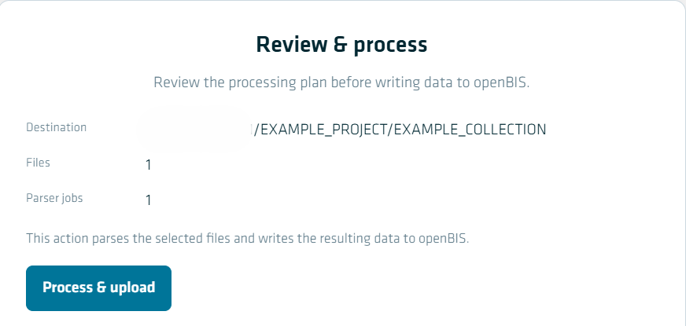
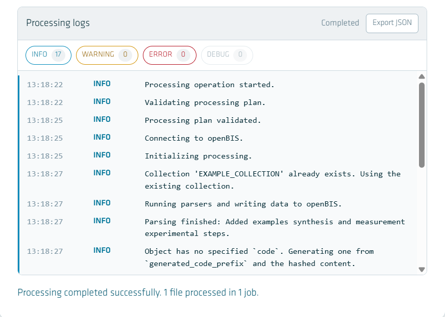

# Use the openBIS Upload Helper Desktop App

This how-to guide explains how to use the **openBIS Upload Helper** desktop application to select local files, assign parsers, and upload the resulting metadata and data to openBIS. It is intended for users who want to process scientific files using the parsers provided with the application.

The application is distributed as a desktop application and is available as a release from the [BAMresearch/openbis-upload-helper repository](https://github.com/BAMresearch/openbis-upload-helper).

!!! note "Prerequisites"

    Before using the application, make sure that:

    * You have access to the relevant openBIS instance.
    * You have an openBIS username and password or a Personal Access Token (PAT).
    * You have permission to upload data to the target Space, Project, and Collection.
    * Your files are supported by one of the parsers included in the application.

---

## Install and update the Desktop App

The openBIS Upload Helper is distributed as a pre-built desktop application through GitHub Releases.

1. Open the [openBIS Upload Helper releases](https://github.com/BAMresearch/openbis-upload-helper/releases).

2. Select the latest release.

3. Download the package for your operating system.

4. Install the application using the downloaded package.

5. Start the **openBIS Upload Helper** from your applications or Start menu.

!!! note

    Users of the released application do not need Python or the development dependencies of the project installed separately.

!!! note "Updating"

    When a new version is released, download and install the newer package from the [GitHub Releases page](https://github.com/BAMresearch/openbis-upload-helper/releases).

---

## First successful run

The following example shows the complete workflow from logging in to verifying that the parsing operation completed successfully.

For this example, assume that:

* the application is installed;
* you have access to an openBIS instance;
* you have a supported example file;
* the target is `EXAMPLE_PROJECT/EXAMPLE_COLLECTION`.

### 1. Open and log in to the application

Start the **openBIS Upload Helper**.

The login screen contains fields for the openBIS server, username, password, and Personal Access Token.

    <label>
        <input type="checkbox">
        
    </label>

1. Enter the URL of your **openBIS server**.
2. Enter your **Username**.
3. Enter your **Password**.

    Alternatively, you can use a **Personal Access Token** instead of a password.

4. Press **Sign in**.

---

### 2. Select the destination

After logging in, select where the parsed data should be stored in openBIS.

    <label>
        <input type="checkbox">
        
    </label>

1. Select the **Space**.
2. Select or enter the **Project**.
3. Optionally, select or enter a **Collection**.

    Leave the Collection empty if the data should be stored directly in the Project.

The destination determines where the parsed data will be written in openBIS.

---

### 3. Select source files

The **Select source files** screen is used to choose the local files or folders that should be processed.

    <label>
        <input type="checkbox">
        
    </label>

You can use the following buttons:

* **Choose folder** — select a folder and process its contents.
* **Add files** — select individual files.
* **Refresh** — refresh the displayed file structure.
* **Clear** — remove the currently selected files and folders.

After selecting your source data, verify that the expected files are displayed.

!!! note

    Files are selected from your local computer. They are not uploaded to openBIS merely by selecting them. The actual transfer takes place when the processing operation is started.

---

### 4. Assign parsers

The **Assign parsers** screen is used to determine which parser should process each file or folder.

    <label>
        <input type="checkbox">
        
    </label>

1. Select a parser from the dropdown menu for a file or folder.

2. A parser assigned to a folder is inherited by its files and subfolders unless a different parser is explicitly assigned.

3. Use **Ignore** when a file or subtree should not be processed.

4. Check the summary at the bottom of the screen.

    It shows the number of assigned files, ignored files, unassigned files, jobs, and parsers.

!!! warning

    Make sure that every file you want to process has a suitable parser assigned before continuing. Unassigned files will not be included in a parser job.

The available parsers depend on the parsers included in the current release of the application. If the file format you want to process is not supported by an available parser, open an issue in the [openBIS Upload Helper GitHub repository](https://github.com/BAMresearch/openbis-upload-helper/issues) to request a new parser.

See [How-to: Create new parsers](create_new_parsers.md#referencing-existing-objects-in-openbis) for details on implementing custom parsers.

---

### 5. Review the processing plan

The **Review & process** screen provides a final overview before data is written to openBIS.

    <label>
        <input type="checkbox">
        
    </label>

Check the following information:

* **Destination** — the selected openBIS Space, Project, and Collection.
* **Files** — the number of files that will be processed.
* **Parser jobs** — the number of parser jobs that will be executed.

If the information is correct, press **Process & upload**.

!!! warning

    This starts the actual processing operation. The selected files are parsed and the resulting metadata and data are written to openBIS.

---

### 6. Review the processing logs

After starting the process, the application displays the **Processing logs**.

    <label>
        <input type="checkbox">
        
    </label>

The log view provides information about the processing operation, including:

* validation of the processing plan;
* connection to openBIS;
* initialization of the parser;
* creation or reuse of collections;
* parser output;
* creation or updating of openBIS objects;
* errors and warnings.

The log counters distinguish between:

* **INFO** — informational messages;
* **WARNING** — warnings that did not necessarily prevent processing;
* **ERROR** — errors that affected processing;
* **DEBUG** — detailed debugging information.

If the operation completes successfully, the application displays a corresponding success message.

You can also use **Export JSON** to export the processing logs for further analysis or reporting.

---

## Understand the interface

The application divides the upload workflow into several steps:

| Step | Purpose |
|---|---|
| **Sign in** | Connect to the openBIS instance and authenticate the user. |
| **Select destination** | Choose the Space, Project, and optional Collection. |
| **Select source files** | Select local files or folders for processing. |
| **Assign parsers** | Assign the appropriate parser to each file or folder. |
| **Review & process** | Verify the processing plan before starting the upload. |
| **Processing logs** | Monitor the processing operation and inspect its result. |

This workflow allows the user to review the intended processing operation before any data is written to openBIS.

---

## Understand data movement

The openBIS Upload Helper is a desktop application. The source files therefore initially remain on the user's local computer.

The general data flow is:

1. **Local files are selected** in the application.
2. **The selected parser runs locally** on the selected files.
3. The parser extracts metadata and creates the corresponding data model objects.
4. The application **connects directly to openBIS**.
5. The resulting metadata and associated datasets are written to the selected openBIS destination.

In particular:

* Selecting files does **not** immediately upload them.
* Parsing is performed locally by the bundled parser.
* A connection to the configured openBIS server is required for authentication and for writing the resulting data.
* The application does not require a separate web server or browser.
* Credentials and Personal Access Tokens are used for the current session.

!!! note

    The exact files and metadata uploaded depend on the parser being used. A parser can extract metadata, create openBIS objects, and upload associated files as datasets.

---

## Existing objects and repeated imports

The parser application can encounter openBIS objects that already exist. The exact behaviour depends on how the parser defines the object and its identifier.

In general, a parser can:

* create new openBIS objects;
* find and update existing objects;
* create datasets associated with the parsed data;
* establish relationships between objects.

When an existing object is reused or updated, the processing log provides information about the operation.

!!! note

    Object matching is determined by the parser and the underlying BAM data model. Therefore, users should check the processing logs when importing data that may already exist in openBIS.

### Repeated imports

When processing the same source data more than once, do not assume that the second run will always produce exactly the same result as the first run.

The result depends on whether the parser provides a stable object `code` or another identifier that allows an existing object to be matched. If an object cannot be matched to an existing object, the parser/application may create a new object instead.

For workflows where repeated imports are expected, check the parser-specific documentation for its object-matching behaviour.

---

## Troubleshooting

### The application cannot connect to openBIS

**Possible causes:**

* The openBIS server URL is incorrect.
* The computer has no network connection to the server.
* The username or password is incorrect.
* The Personal Access Token is invalid or expired.
* The user does not have access to the openBIS instance.

**What to do:**

1. Check the **openBIS server** URL.
2. Check your credentials or Personal Access Token.
3. Verify that the openBIS instance is reachable from your computer.
4. Try signing in again.

---

### A Space, Project, or Collection cannot be selected

**Possible causes:**

* The user does not have permission to access the requested location.
* The openBIS connection failed.
* The requested entity does not exist.

**What to do:**

1. Verify that you are connected to the correct openBIS instance.
2. Check that the Space, Project, or Collection exists.
3. Check your permissions in openBIS.

---

### A file has no suitable parser

**Possible cause:**

The file format or folder structure is not supported by one of the parsers bundled with the installed application.

**What to do:**

1. Check the available parsers in the **Assign parsers** step.
2. Verify that the selected parser supports your file format.
3. Make sure you are using the latest application release.
4. If the format is not supported, request a new parser through the project's GitHub repository.

---

### Files are shown as unassigned

**Possible cause:**

No parser has been assigned to the file or its parent folder.

**What to do:**

1. Go to **Assign parsers**.
2. Select an appropriate parser for the file or parent folder.
3. Verify that the **unassigned** counter is `0`.
4. Continue to **Review & process**.

---

### The parser finishes with warnings

Warnings do not necessarily mean that the complete processing operation failed.

Check the **WARNING** messages in the processing logs and determine whether they affect the resulting data.

If the operation completed successfully, verify the resulting objects and datasets in openBIS.

---

### The parser finishes with errors

If the **ERROR** counter is greater than `0`:

1. Read the error messages in **Processing logs**.
2. Identify the file or parser associated with the error.
3. Check whether the source file has the expected format and structure.
4. Check that the selected openBIS destination is correct.
5. If necessary, export the logs using **Export JSON**.
6. When reporting the problem, provide the exported logs together with information about the source file and the parser that was used.

!!! tip

    When reporting a parser problem, include a representative example file whenever possible. This makes it easier to reproduce and diagnose the problem.

---

## Getting help and reporting problems

The openBIS Upload Helper repository is hosted on GitHub:

[BAMresearch/openbis-upload-helper](https://github.com/BAMresearch/openbis-upload-helper)

Use the repository's **Issues** section for:

* bug reports;
* usability problems;
* feature requests;
* parser requests;
* installation or packaging problems.

For parser requests, provide information about the file format or folder structure, the metadata that should be extracted, the expected openBIS representation, and representative example files where possible.

For the latest version of the application, use the [openBIS Upload Helper Releases](https://github.com/BAMresearch/openbis-upload-helper/releases).
